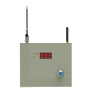
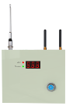
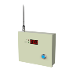
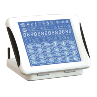
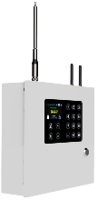

# 安定宝协议

## 一、概述 

### 名词解释

* 探测器

	有太阳能无线光栅、红外幕帘、无线门磁、紧急按钮等各种类型，通过无线信号与主机通信。

* 主机

	报警主机，与探测器进行无线通信，与接警中心进行 `TCP` 网络通信，主机作为客户端主动连接接警中心。当探测器被触发或主机布撤防等事件产生时，通过网络上报至接警中心，并可以接收接警中心的远程控制命令。

* 接警中心

	运行在服务器的程序，监听客户端的 `TCP` 连接，可以处理主机发送的各种事件，可以对主机进行远程控制。


主机与接警中心之间通信使用安定宝协议 `DC05`，`DC07`，`DC09`，并根据我司需要添加了部分私有事件代码。

使用主机时，需要先配置安定宝ID、接警中心IP、端口等必要信息，主机由安定宝ID唯一标识，探测器由防区号唯一标识。网络模块+工程主机可以使用 [网络模块配置工具](https://net-mod-config-tool-1251421422.cos.ap-chengdu.myqcloud.com/%E7%BD%91%E7%BB%9C%E6%A8%A1%E5%9D%97%E6%89%B9%E9%87%8F%E9%85%8D%E7%BD%AE%E5%B7%A5%E5%85%B7v1.8.2.195.exe) 进行配置，其他型号的主机可以使用手机APP进行配置（配置接警中心IP、端口时，手机APP内设置界面找到 **标准接警中心** ）。

主机开机后以 `TCP` 协议主动连接直连型接警中心，连接成功后报告一次状态（及主机类型），然后开始定时发送心跳包(`NULL`)，接收方应及时回应相同 `seq` 的 `ACK` 包；主机有事件（状态改变、产生警情）发生时上报接警中心，`id` 使用 `ADM-CID` 或 `HENG-BO`。

接警中心远程控制发送撤防命令时，密码放在 `xdata` 段内。

本端（主机或接警中心）收到除 `DUH/ACK` 包之外的其他有效数据包时，都应回应相同 `seq` 的 `ACK` 包，否则对端（接警中心或主机）会进行重发。

## 二、传输协议

使用 `ASCII` 码传输

### **格式**（以下出现的 `<>` 仅作分隔符，实际数据中不存在）：

`<LF>` `<crc16>` `<length>` `<"id">` `<seq>` `<Rrcvr>` `<Lpref>` `<#acct>` `<data>` `<*xdata>` `<timestamp>` `<CR>`

### **各字段说明：**

* `LF` 固定起始符 0x0A
* `crc16` 固定长度4Bytes, 表示从 `id` 的左引号开始，至 `timestamp` 的最后一个字节结束(长度为 `length` )计算出的 `crc16` 值，以16进制数字的ASCII码表示
* `length` 从 `id` 的左引号开始，至 `timestamp` 的最后一个字节结束的字符串长度，以16进制数字的ASCII码表示，定长4Bytes
* `"id"` 事件类型，分为 `NULL, ACK, DUH, ADM-CID, HENG-BO` 等，分别为心跳、回应、错误、主机事件、恒博事件。除事件 `ADM-CID/HENG-BO` 外，其他三种类型的 `data` 段都为空值  `[]`。
* `seq` 序号，定长4 Bytes，代表的十进制数字为主机发送命令字的序号，范围 `0001~9999`，超过 `9999` 则从1开始再次循环。`seq` 被用来判断主机发出的 `ADM-CID/HENG-BO` 类型命令字是否得到接警平台的正确处理。例：平台要对主机发出的 `NULL/ADM-CID/HENG-BO` 类型事件进行回应，回应的 `seq` 以接收到的 `seq` 为准。主机收到回应后会判断 `seq` 与之前发送的 `seq` 是否相同：相同则说明该事件已得到处理，否则会进行重发。
* `Rrcvr` 以R开头的一段十六进制数字字符串，数字长度范围`1~6`，暂时仅占位，无意义。字段总长度`2~7` Bytes。
* `Lpref`  以L开头的一段十六进制数字字符串，数字长度范围`1~6`，暂时仅占位，无意义。字段总长度`2~7` Bytes。
* `#acct` 以`#`开头，后跟有限位十进制数字(SIM卡号或出厂编号）或安定宝ID，表示主机的账号（有SIM卡的主机为手机号，无SIM卡的是出厂编号，有些主机直连时使用了安定宝ID为账号）
* `data` 格式为 `[]`（左右中括号，无空格，定长2Byte）或 `[#ademco_id|event gg zone]`（有空格）。当事件类型为 `NULL/ACK/DUH` 时 `data` 段为`[]`；当事件类型为 `ADM-CID/HENG-BO` 时 `data` 段格式为 `[#acct|event gg zone]`：
  * `#ademco_id` 主机的安定宝ID，以 `#` 开头的4位或6位或8位十六进制数字，我司使用固定6位，如安定宝ID `16` 编码为6位是 `000010`，传输为 `#000010`。
  * `event` 定长4Bytes，事件代码，具体含义见后文。
  * `gg` 定长2 Bytes， 一般为00，当非00时有特殊含义，参考下方 *4.1 事件报告与远程控制*
  * `zone` 防区号，范围 `0~999`。`zone` 为 `0` 表示主机自身事件，如布防、撤防、防拆等。`1~999` 则为防区号，表示防区事件。定长3 Bytes。
* `*xdata` 可选的字段，一般情况下留空，仅有限几种情况需要带 `xdata`：撤防时使用 `xdata` 传输密码、索要防区信息时使用 `xdata` 做串口命令透传。具体格式参考下方 *4.2 xdata 段格式*。
* `timestamp` 时间戳字段，格式为 `_HH:MM:SS,mm-DD-YYYY`，定长20Bytes

* `CR` 固定结束符，0x0D

## 三、事件码

### 事件码前缀有2种

* `1/3` 前缀，`1` 表示打开，`3` 表示关闭。如 `3400` 表示布防，`1400` 表示撤防。
* `E/R` 前缀，`E` 表示打开，`R` 表示关闭。如 `R400` 表示布防，`E400` 表示撤防。
* 报警时 `1/E` 前缀表示警情触发，`3/R` 表示警情恢复，如 `1387` 表示探测器受到强光干扰，`3387` 表示防区从光扰状态恢复。

### 主机状态

|事件码|含义|en|
|-----|----|--|
|3400|布防|ARM|
|1400|撤防|DISARM|
|1456|半布防|HALFARM|
|3456|半布防|HALFARM|
|1120|紧急报警|EMERGENCY|

### 防区报警

|事件码|含义|en|
|-----|----|--|
|1130|盗警|BURGLAR|
|1134|门铃|DOORRINGING|
|1110|火警|FIRE|
|1121|胁迫|DURESS|
|1151|煤气|GAS|
|1113|水警|WATER|
|1137|防拆|TAMPER|
|1383|防区防拆|ZONE_TAMPER|
|1570|旁路|BYPASS|
|3570|解除旁路|BYPASS_RESUME|

### 防区异常

|事件码|含义|en|
|-----|----|--|
|1301|主机AC掉电|AC BROKE|
|3301|主机AC恢复|AC RECOVER|
|1302|低电|LOWBATTERY|
|3302|复电|BATATTERY_RECOVER|
|1311|坏电|BADBATTERY|
|1387|光扰|SOLARDISTURB|
|1381|失效|DISCONNECT|
|3381|恢复|RECONNECT|
|1384|防区电源故障|BATTERY_EXCEPTION|
|3384|防区电源故障恢复|BATTERY_EXCEPTION_RECOVER|
|1380|防区其他故障|OTHER_EXCEPTION|
|3380|防区其他故障恢复|OTHER_EXCEPTION_RECOVER|
|1393|失联|LOST|
|3393|恢复|LOST_RECOVER|
|3100|液晶主机清除异常指示|LCD CLEAR EXCEPTION|

### *恒博私有事件码*

|事件码|含义|en|
|-----|----|--|
|1485|485断开|485DIS|
|3485|485恢复|485CONN|
|1700|链路挂起|CONN_HANGUP|
|3700|链路恢复|CONN_RESUME|
|1701|撤防密码错误|DISARM_PWD_ERR|
|1702|分防区异常|SUB_SENSOR_EXCEPTION|
|3702|分防区恢复|SUB_SENSOR_RESUME|
|1703|分防区电源异常|SUB_POWER_EXCEPTION|
|3703|分防区电源恢复|SUB_POWER_RESUME|
|1704|串口透传|COM_PASSTHROUGH|
|2704|进入设置状态|ENTER_SET_MODE|
|3704|拒绝/停止设置|EXIT_SET_MODE|
|1705|查询|QUERY|
|1706|写入主机信息|WRITE_TO_MACHINE|
|1707|我是网络模块|I_AM_NET_MODULE|
|1717|我是GPRS主机|I_AM_GPRS_MACHINE|
|1727|我是液晶主机|I_AM_LCD_MACHINE|
|1737|我是网线主机|I_AM_WIRE_MACHINE|
|1747|我是WiFi主机|I_AM_WIFI_MACHINE|
|1757|我是三区段主机|I_AM_3_SECTION_MACHINE|
|1767|我是物联卡主机|I_AM_IOT_MACHINE|
|1777|我是真彩主机|I_AM_TRUE_COLOR|
|1787|我是简化版物联卡主机|I_AM_GPRS_IOT|
|1797|我是GPRS主机能打电话|I_AM_GPRS_PHONE|
|1709|手机用户SOS|SOS|
|1711|手机用户消警|PHONE_USER_CANCLE_ALARM|
|1712|主机进入设置状态|ENTER_SETTING_MODE|
|3712|主机退出设置状态|EXIT_SETTING_MODE|
|1710|主机恢复出厂设置|RESTORE_FACTORY_SETTINGS|
|1713|主机恢复出厂设置|RESTORE_FACTORY_SETTINGS|
|1756|SIM卡为物联卡|SIM card is IOT|
|2756|SIM卡为平台物联卡|SIM card is Platform IOT|
|3756|SIM卡为非物联卡|SIM card is not IOT|
|1798|索要主机类型|WHAT_IS_YOUR_TYPE|
|1799|信号强度变化|SIGNAL_STRENGTH_CHANGED|

### *恒博主机类型对照表*

*SMS指主机自身是否可以拨打电话、发送短信，不是指通过阿里语音打电话*
|事件码类型|主机类型|半布防|信号强度|防区|有线防区|SMS|内核|网络|型号|
|---------|-------|------|-------|----|-------|---|---|---|----|
|1707 我是网络模块|3 网络模块+工程主机|√| |1~999|1~8| |jjf|wzq|<ul><li>HB-G250</li></ul>|
|1717 我是GPRS主机|4 GPRS主机| |√|1~99| |√|wzq|qfm|<ul><li>HB-4040G</li><li>HB-5050G</li><li>HB-5050G-4G</li></ul>|
|1727 我是液晶主机|5 液晶主机|√|√|1~249| |√|jjf|qfm|<ul><li>HB-BJQ560</li><li>HB-BJQ560B</li></ul>|
|1737 我是网线主机|6 网线主机| | |1~99| | |wzq|wzq|<ul><li>HB-4040R</li><li>HB-5050R</li></ul>|
|1757 我是三区段主机|8 三区段主机| |√|1~191|61~68|√|jjf|qfm|<ul><li>HB-G1000</li><li>HB-G1000-4G</li></ul>|
|1767 我是物联卡主机|9 物联卡主机| |√|1~60| | |jjf|qfm|<ul><li>HB-2050-4GW</li></ul>|
|1777 我是真彩主机|7 真彩主机| |√|1~68|1~8|√|jjf|qfm|<ul><li>HB-G1000</li><li>HB-G1000-4G</li></ul>|
|1787 我是简化版物联卡主机|2 简化的物联卡主机| |√|1~99| | |wzq|qfm|<ul><li>HB-5050G-4GW</li></ul>|
|1797 我是GPRS主机能打电话|10 GPRS主机能打电话| |√|1~60| |√|jjf|qfm|<ul><li>HB-2050</li></ul>|


### *恒博主机型号示例图片*

|型号|示例图片|
|---|--------|
|HB-2050||
|HB-2050-4GW||
|HB-4040G||
|HB-4040R||
|HB-5050G||
|HB-5050G-4G||
|HB-5050G-4GW||
|HB-5050R||
|HB-BJQ560||
|HB-BJQ560B||
|HB-G1000||
|HB-G1000-4G||
|HB-G250||


### *恒博主机类型与支持的防区属性对照表*

* 防区属性是否支持防拆

||00 匪警全局|01 匪警紧急|02 火警防区|03 胁迫防区|04 燃气防区|05 淹水防区|06 分机|07 遥控器|08 匪警半局|09 屏蔽防区|0A  门铃防区|0F 旁路防区|
|----|----|----|----|----|----|----|----|----|----|----|----|----|
|防拆支持|√|√| |√| | |√| |√| | |√|

* 主机类型与支持的防区属性对照表

|事件码类型|主机类型|00 匪警全局|01 匪警紧急|02 火警防区|03 胁迫防区|04 燃气防区|05 淹水防区|06 分机|07 遥控器|08 匪警半局|09 屏蔽防区|0A 门铃防区|0F 旁路防区|
|---------|-------|----|----|----|----|----|----|----|----|----|----|----|----|
|1707 我是网络模块|3 网络模块+工程主机|√|√|√|√|√|√|√|√|√|√|√|√|
|1717 我是GPRS主机|4 GPRS主机|√|√|√|√|√|√| |√| | | | |
|1727 我是液晶主机|5 液晶主机|√|√|√|√|√|√|√|√|√|√|√|√|
|1737 我是网线主机|6 网线主机|√|√|√|√|√|√| |√| | | | |
|1757 我是三区段主机|8 三区段主机|√|√|√|√|√|√| |√| |√|√|√|
|1767 我是物联卡主机|9 物联卡主机|√|√|√|√|√|√| |√| |√|√|√|
|1777 我是真彩主机|7 真彩主机|√|√|√|√|√|√| |√| |√|√|√|
|1787 我是简化版物联卡主机|2 简化的物联卡主机|√|√|√|√|√|√| |√| | | | |
|1797 我是GPRS主机能打电话|10 GPRS主机能打电话|√|√|√|√|√|√| |√| | | | |

## 四、恒博扩展

### 4.1 事件报告与远程控制

`data` 段 `gg` 值含义：

|发送方|接收方|gg值(ascii字符)|含义|
|-----|------|--------------|----|
|主机|	接警中心	|00|	主机事件|
|主机|	接警中心	|01~03|	三区段主机的状态事件，区段号为gg|
|接警中心|	主机	|00|	对主机操作|
|接警中心|	主机	|01~03|	对三区段主机操作，区段号为gg|

说明：三区段主机有三个防区段，每个区段有一定数量的防区，区段可以各自布撤防。

### 4.2 `xdata` 段格式：`[len xdata…]`，长度可变

`len` 可以使用 `两个 hex 字节` 或 `四个 decimal char` 表示，主机只解析 `两个 hex 字节` 的 `xdata`。

* 使用两个 `hex`

    在 `[` 之后，使用 `2个hex` 表示 `xdata` 有效数据的长度，不包括 `'['、len本身和 ']'`

    例：`xdata` 为字符串 `ABC`，有效长度为 `3`，则数据的十六进制表示为：

    `0x5B 0x00 0x03 0x41 0x42 0x43 0x5D`

    `ASCII` 可读格式：

    `[\x0\x3ABC]`

* 使用四个 `decimal char`

    在 `[` 之后，使用4个decimal char表示 `xdata` 有效数据的长度，不包括 `'['、len本身和 ']'`

    例：`xdata` 为字符串 `ABC`，有效长度为 `3`，则数据的十六进制表示为：

    `0x5B 0x30 0x30 0x30 0x33 0x41 0x42 0x43 0x5D`

    `ASCII` 可读格式：

    `[0003ABC]`

### 4.3 备份恢复相关 （废弃）

`gg`: `EE` 分主机，`0` 直属防区，`CC` 未对码防区。

`xdata`: 使用7个字节，2字节表示长度（0x0, 0x3），有效数据3个字节，1字节状态或属性， 2字节物理地址。

`[len  status  addr_hi addr_lo]`

当 `gg` 为 `CC` 时，`xdata` 为空。

### 4.4 索要防区信息流程图（待定）

主机的 1704 回复防区信息数据格式与 4.3 备份恢复相关的格式相同。


### 4.5 主机信号强度变化

主机每隔一段时间向接警中心发送主机信号强度，数值由 `xdata` 传输。

有效数据1字节，以 `BCD` 格式编码

例：

信号强度 `27`，传输为 `0x27`

编码：`sig = ((十位数) << 4) | (个位数 & 0x0F)`

解码：`((sig >> 4) & 0x0F) * 10 + (sig & 0x0F)`

### 4.6 远程控制标识操作源

当事件码如下内容且（`gg` 为 `00`、或`gg`为`01`/`02`/`03`（三区段主机））时，使用 `zone` 标识操作源：

|事件码|	含义|
|-----|--------|
|400|	布撤防|
|456|	半布防|
|120|	紧急报警|
|121|	胁迫|
|711|	手机用户消警|

防区号与操作源对照表：

|zone|	操作源|	数量|	备注|
|----|--------|----|-------|
|000 |	主机  |	1	| 
|001-097|	遥控器|	97	|
|098|	中转接警中心|	1	|
|099|	直连接警中心|	1	|
|100-199|	APP|	100|	1开头，后2位数字使用手机号码的2位尾号|
|200-255|	微信公众号用户|	56	|

## 附录

### crc16算法

```cpp
/**
* @brief 计算一个字节（char）的crc16值
* @param c 要计算crc16的字节
* @param crc 初始crc值
* @return crc16
*/
static unsigned short CalculateCRC_char(char c, unsigned short crc)
{
	static unsigned short crcTable[] = {
		/* DEFINE THE FIRST ORDER POLYINOMIAL TABLE */
		0x0000, 0xC0C1, 0xC181, 0x0140, 0xC301, 0x03C0, 0x0280, 0xC241,
		0xC601, 0x06C0, 0x0780, 0xC741, 0x0500, 0xC5C1, 0xC481, 0x0440,
		0xCC01, 0x0CC0, 0x0D80, 0xCD41, 0x0F00, 0xCFC1, 0xCE81, 0x0E40,
		0x0A00, 0xCAC1, 0xCB81, 0x0B40, 0xC901, 0x09C0, 0x0880, 0xC841,
		0xD801, 0x18C0, 0x1980, 0xD941, 0x1B00, 0xDBC1, 0xDA81, 0x1A40,
		0x1E00, 0xDEC1, 0xDF81, 0x1F40, 0xDD01, 0x1DC0, 0x1C80, 0xDC41,
		0x1400, 0xD4C1, 0xD581, 0x1540, 0xD701, 0x17C0, 0x1680, 0xD641,
		0xD201, 0x12C0, 0x1380, 0xD341, 0x1100, 0xD1C1, 0xD081, 0x1040,
		0xF001, 0x30C0, 0x3180, 0xF141, 0x3300, 0xF3C1, 0xF281, 0x3240,
		0x3600, 0xF6C1, 0xF781, 0x3740, 0xF501, 0x35C0, 0x3480, 0xF441,
		0x3C00, 0xFCC1, 0xFD81, 0x3D40, 0xFF01, 0x3FC0, 0x3E80, 0xFE41,
		0xFA01, 0x3AC0, 0x3B80, 0xFB41, 0x3900, 0xF9C1, 0xF881, 0x3840,
		0x2800, 0xE8C1, 0xE981, 0x2940, 0xEB01, 0x2BC0, 0x2A80, 0xEA41,
		0xEE01, 0x2EC0, 0x2F80, 0xEF41, 0x2D00, 0xEDC1, 0xEC81, 0x2C40,
		0xE401, 0x24C0, 0x2580, 0xE541, 0x2700, 0xE7C1, 0xE681, 0x2640,
		0x2200, 0xE2C1, 0xE381, 0x2340, 0xE101, 0x21C0, 0x2080, 0xE041,
		0xA001, 0x60C0, 0x6180, 0xA141, 0x6300, 0xA3C1, 0xA281, 0x6240,
		0x6600, 0xA6C1, 0xA781, 0x6740, 0xA501, 0x65C0, 0x6480, 0xA441,
		0x6C00, 0xACC1, 0xAD81, 0x6D40, 0xAF01, 0x6FC0, 0x6E80, 0xAE41,
		0xAA01, 0x6AC0, 0x6B80, 0xAB41, 0x6900, 0xA9C1, 0xA881, 0x6840,
		0x7800, 0xB8C1, 0xB981, 0x7940, 0xBB01, 0x7BC0, 0x7A80, 0xBA41,
		0xBE01, 0x7EC0, 0x7F80, 0xBF41, 0x7D00, 0xBDC1, 0xBC81, 0x7C40,
		0xB401, 0x74C0, 0x7580, 0xB541, 0x7700, 0xB7C1, 0xB681, 0x7640,
		0x7200, 0xB2C1, 0xB381, 0x7340, 0xB101, 0x71C0, 0x7080, 0xB041,
		0x5000, 0x90C1, 0x9181, 0x5140, 0x9301, 0x53C0, 0x5280, 0x9241,
		0x9601, 0x56C0, 0x5780, 0x9741, 0x5500, 0x95C1, 0x9481, 0x5440,
		0x9C01, 0x5CC0, 0x5D80, 0x9D41, 0x5F00, 0x9FC1, 0x9E81, 0x5E40,
		0x5A00, 0x9AC1, 0x9B81, 0x5B40, 0x9901, 0x59C0, 0x5880, 0x9841,
		0x8801, 0x48C0, 0x4980, 0x8941, 0x4B00, 0x8BC1, 0x8A81, 0x4A40,
		0x4E00, 0x8EC1, 0x8F81, 0x4F40, 0x8D01, 0x4DC0, 0x4C80, 0x8C41,
		0x4400, 0x84C1, 0x8581, 0x4540, 0x8701, 0x47C0, 0x4680, 0x8641,
		0x8201, 0x42C0, 0x4380, 0x8341, 0x4100, 0x81C1, 0x8081, 0x4040,
	};

	unsigned short CRC = crc;
	auto tmp = static_cast<unsigned short>(CRC >> 8) ^ (crcTable[static_cast<unsigned char>(c) ^ static_cast<unsigned char>(CRC & 0xFF)]);
	CRC = static_cast<unsigned short>(tmp);
	return CRC;
}

/**
* @brief 计算一段数据包的crc16值
* @param buff 要计算crc16的数据包指针
* @param len 要计算crc16的数据包长度
* @param crc 初始crc值
* @return crc16
*/
static unsigned short CalculateCRC(const char* buff, size_t len, unsigned short crc = 0)
{
	unsigned short CRC = crc;
	for (size_t i = 0; i < len; ++i) {
		CRC = CalculateCRC_char(buff[i], CRC);
	}

	return CRC;
}
```

### 示例

* 主机000000布防

    "\n02130047\"HENG-BO\"0000R1234L6789#000000[#000000|3400 00 000]_17:15:29,12-09-2015\r"

* 主机000000心跳

    "\n93B30031\"NULL\"0000R1234L6789#000000[]_17:24:14,12-09-2015\r"

* 接警中心心跳回应

    "\nF0550030\"ACK\"0000R1234L6789#000000[]_17:27:09,12-09-2015\r"
